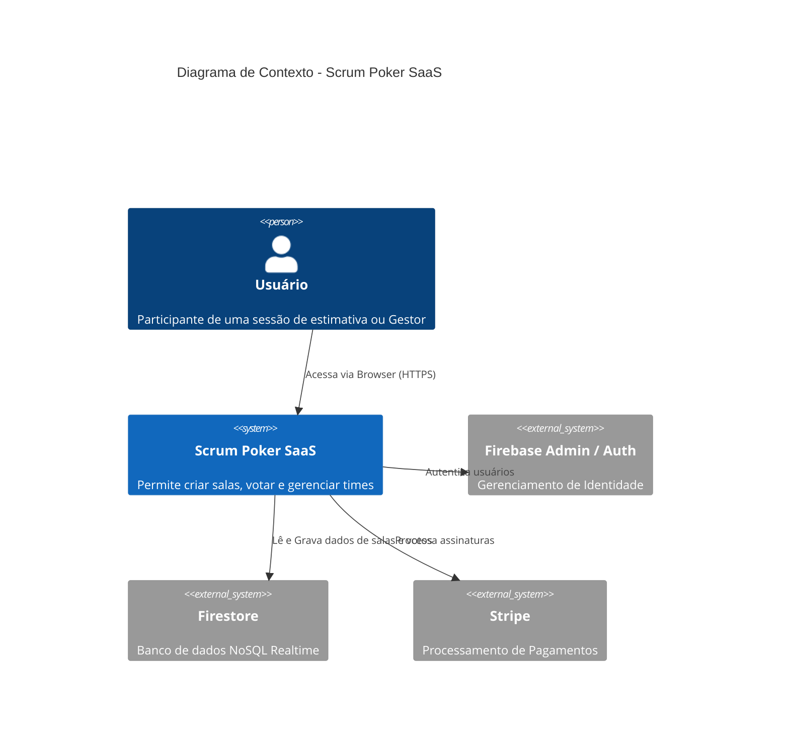

# System Design - Scrum Poker SaaS

## Visão Geral da Arquitetura

O **Scrum Poker SaaS** é uma aplicação web moderna, projetada para ser rápida, escalável e focada na experiência do usuário. A arquitetura segue o padrão **Serverless**, utilizando o **Firebase** como backend principal e **Next.js** para o frontend e API routes.

### Diagrama de Contexto (C4)

## Stack Tecnológica

| Camada             | Tecnologia                   | Motivação                                                                     |
| :----------------- | :--------------------------- | :---------------------------------------------------------------------------- |
| **Frontend**       | **Next.js 14+ (App Router)** | SSR/SSG, rotas modernas, otimização de performance.                           |
| **Estilização**    | **TailwindCSS**              | Desenvolvimento rápido, design consistente e leve.                            |
| **Componentes**    | **Headless UI / Radix UI**   | Acessibilidade e flexibilidade.                                               |
| **Estado Global**  | **Zustand**                  | Gerenciamento de estado simples e performático (menos boilerplate que Redux). |
| **Backend (BaaS)** | **Firebase**                 | Realtime Database (Firestore), Auth e Hosting integrados.                     |
| **Banco de Dados** | **Cloud Firestore**          | NoSQL escalável, listeners em tempo real nativos.                             |
| **Pagamentos**     | **Stripe**                   | Padrão de mercado, fácil integração via Webhooks.                             |

## Fluxo de Dados (Realtime)

1.  **Criação de Sala**: O `Facilitador` cria uma sala. Um documento é criado em `rooms/{roomId}`.
2.  **Entrada na Sala**: `Participantes` acessam a sala. O cliente se inscreve (listener) nas coleções `rooms/{roomId}` e `rooms/{roomId}/votes`.
3.  **Votação**: Quando um usuário vota, um documento é criado/atualizado em `rooms/{roomId}/votes/{userId}`.
4.  **Sincronização**: O Firestore notifica todos os clientes conectados sobre a mudança. O frontend recalcula o estado visual (quem votou) instantaneamente.
5.  **Reveal**: O `Facilitador` altera o status da sala para `REVEALED`. Clientes recebem a atualização e mostram as cartas.

## Segurança e Escalabilidade

- **Firebase Security Rules**: Garante que apenas usuários na sala possam ler/escrever votos.
- **Limites do Plano Free**: Implementados via verificação no _client-side_ (UX) e _server-side_ (Firestore Rules / Cloud Functions).
- **Performance**: Uso de `onSnapshot` apenas para a sala ativa para minimizar leituras desnecessárias.
